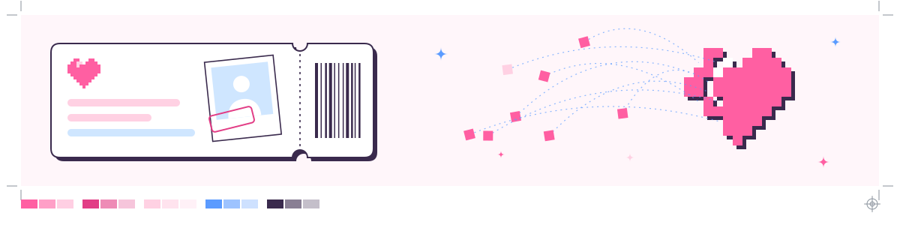

<picture>
  <source media="(prefers-color-scheme: dark)" srcset="assets/hero-dark.svg">
  
</picture>

I used to be an editor and a graphic designer. Somewhere in there I noticed the two jobs were one job: predicting what a brain will do with what you show it. Where the eye lands first. What a cut makes you feel. What you'll fill in without being told.

After a while, the brain doing the predicting got more interesting than anything I could put in front of it. So now I study computer science and build the machinery myself: a camera that knows when it isn't sure, a ledger nobody can quietly edit, an engine that shows its working.

## The long game

<picture>
  <source media="(prefers-color-scheme: dark)" srcset="assets/matter-dark.svg">
  
</picture>

My long-term goal is a system where brain, silicon, genome and intelligence work as one. It sounds like a slogan until you notice how much mathematics they already share. The line above describes a capacitor charging, a neuron's membrane below threshold, a protein settling to its steady level, and the memory inside a recurrent network. Same equation, different physics.

I'm working toward it with a field manual I wrote for myself, *Matter That Knows*. It starts from one question: how does matter come to sense, predict, remember, decide and act, in cells, in brains and in machines, and how do we build it? The rules are short. Predict a number before you measure it. Build the thing if you want to understand it. And every analogy has to carry the result that would break it:

| Bridge | Biology | Machine | Breaks if |
| :-- | :-- | :-- | :-- |
| Membrane = RC circuit | A neuron's leak and capacitance | Leaky integrate-and-fire unit | Voltage-gated channels take over above threshold |
| Dopamine = TD error | Bursts on surprise, dips on omission | $\delta = r + \gamma V(s') - V(s)$ | Dopamine tracks salience or movement instead of value |
| Memory = energy minimum | Hippocampal attractors | Hopfield networks; attention is one update step | Real recall turns out not to be attractor dynamics |
| Genome = program | Gene regulatory networks | Boolean circuits; DNA language models | Context and chemistry outweigh the sequence |

The builds climb from a membrane to a language model: reading my own body's signals, a neuron from scratch, memory as energy, a GPT from scratch, prediction error twice, a genome read with my own aligners, and spiking neurons in Verilog on an FPGA. Beside them runs the hardware: a precision logger, a switching power supply, a synthesiser, a balancing robot, a RISC-V CPU, a software radio. Nothing in the manual has a date. You move on when the proof holds.

Right now I'm at the first horizon: measure and model.

## Proofs

In print, a proof is the test sheet you check before the full run. These are mine, all from 2026.

### campus-guard

**An ID check for a campus that won't accuse anyone on a single frame.** A camera on a patrol rover finds people, recognises enrolled students by face and checks for a valid ID card. Only well-evidenced violations reach a human reviewer, who decides whether a fine exists.

- Identity is decided across many frames, and the best match has to beat the runner-up by a margin. "Not sure" is a real answer, and it can never turn into an accusation.
- When the tracker fuses two people into one ID, the system notices and blames neither. A face that could belong to two people goes to no one.
- ID cards carry HMAC-signed QR codes, sized from the optics: a 44 mm code at about three pixels per module reads to roughly 0.7 m on 1080p and 1.3 m on 4K, so cards are always read from the full-resolution frame.
- Three models share one real-time loop on a laptop (YOLO11 with ByteTrack, InsightFace ArcFace, YOLO-World). Evidence waits in a queue that survives Wi-Fi drops, and reviewers work in a Bloomberg-style console.

**Proven:** end to end on a live webcam; CI green, with 770 Python tests and 242 TypeScript unit tests. **Not yet:** calibrated accuracy numbers, or a run on the rover itself.

Python, FastAPI, Ultralytics, InsightFace, Supabase (Postgres, pgvector, row-level security, pg_cron), Next.js. Private repo; a browser simulation with the same thresholds runs on the <a href="https://vishvakrit.vercel.app/projects/rudram/">RUDRAM page</a>.

### VISHVAKRIT

**My robotics team's website, where you can take the machines apart.** VISHVAKRIT is two students building robots that keep watch, and I'm the software lead. The site shows both machines in 3D: RUDRAM, a campus-security rover that exists as a prototype, and MATSYA, an underwater drone that is still a concept. Five small simulations let you play with the physics behind them.

- Both machines are modelled entirely in code, with no model files: lathe-turned wheels, a hull swept from superellipse sections, NACA-profile fins. The holes in RUDRAM's wheels spell its name in Morse code, after Curiosity, whose wheels print JPL across Mars.
- The water is hand-written GLSL: caustics injected into the hull's materials, light shafts, 1,400 flecks of marine snow animated in the vertex shader, and light absorbed channel by channel with depth, so red fades first, as it does in real water.
- A frame pacer lowers resolution by a square-root law when frames run slow, a mesh batcher cuts draw calls, and every sound is synthesised live with Web Audio.
- The logo is computed rather than drawn: the nodal lines of a square plate vibrating in mode (4, 2), which is where sand settles.

**Live:** [vishvakrit.vercel.app](https://vishvakrit.vercel.app)

three.js, GLSL, GSAP, Vite, plain JavaScript. 20 QA suites, with mutation testing.

### ledger-one

**The back office for a 195-villa housing project, where money can't be quietly edited.** Built for a housing society's board: members, plots, payments, what's still due, and an audit trail nobody can rewrite. I built it solo in about 25 days.

- Money is append-only, and Postgres enforces it, not the app. Triggers refuse every update, delete and truncate on the money and history tables. A recorded payment can only be voided, with a written reason.
- Every amount is an integer number of paise from the database to the screen, property-tested with fast-check. A constraint checked at commit makes each payment's split lines add up exactly to its total.
- Large payments need a second, different board member to approve them, and the database enforces that too. Row-level security covers all 28 tables.
- The society's real register is a messy spreadsheet, so the importer finds headers wherever they are, never mistakes a subtotal for a payment, fingerprints rows by meaning so re-imports are safe, and has to pass a reconciliation check inside the database before anything is written.

**Proven:** 1,192 unit tests passing, plus 121 end-to-end tests; CI runs type checks, lint, tests, the build, a dependency audit and a secret scan.

Next.js 16, React 19, TypeScript, Supabase Postgres (18 views, 46 functions, 78 triggers), Vitest, fast-check, Playwright. Private, since it's built for a real board.

### DAARI

**A career-path engine for Andhra Pradesh that shows its working.** *Daari* means "the path" in Telugu. Tell it the job you want and it plans what to learn and in what order, then shows you exactly what changes when you pick up a skill or the job market moves. Its interface speaks English, Telugu and Hindi. We built it at a hackathon as team ASURA; I wrote the engine.

- The language model never decides. Every number comes from deterministic code and arrives with its parts, so any score can be explained line by line.
- The roadmap is a demand-weighted topological order over a prerequisite graph, and the before-and-after view diffs honestly: on the live demo, learning SQL takes 40 hours off a 310-hour path.
- The engine includes an adaptive skill test built on the Rasch model. It picks each question for the most information, and its uncertainty is property-tested to never grow.
- A Scam Shield flags risky job posts and quotes the exact words that triggered each rule.

**Live:** [daari-web.vercel.app](https://daari-web.vercel.app), with the engine in [its pull request](https://github.com/dmrk22/asura/pull/1). **Not yet:** the data covers 24 skills and 2 roles so far.

Python, FastAPI, NumPy, NetworkX, Hypothesis, Next.js, next-intl, d3-force. Built in two days.

### rebeka

**A personal operating system, built foundation first.** My phone already sees my bank messages, payments, location and health data. rebeka will turn those facts into numbers I can act on, like how many classes I can still miss or what's safe to spend this week. No AI at runtime, and every number traceable to the rule and the records behind it. The foundation is built; the product comes next.

- Postgres is append-only and records provenance on every row: which rule, which inputs, when. The database itself refuses edits.
- The ingest API is idempotent and hardened in a deliberate order: rate limits before any database work, hashed per-device tokens, and a 14-type event contract checked on arrival.
- Money and time are branded types, so mixing paise with minutes is a compile error.
- Design quality is a CI gate: WCAG and APCA contrast, golden-ratio layout, frame-time p95, Lighthouse and a bundle budget. A test even rejects blue-purple hues.

**Proven:** 788 tests; a red-team audit found 16 issues and fixed all 16, each with a test that failed first. **Next:** the money, attendance and forecast engines.

TypeScript, Hono, Drizzle, PostgreSQL, React 19, Vite, Docker, Caddy, fast-check, Playwright, Lighthouse CI. Private repo.

### A six-hour gift

**A booking site where the fee is a selfie.** A tiny, phone-first present: pick a date, a time and a place, pay with a photo, and get a boarding-pass ticket to share. No backend, no accounts, no tracking; the photo never leaves the phone unless you share it.

- Every visual is drawn in code, as SVG, CSS or canvas. There are no image files apart from the favicon.
- The success moment is one choreographed timeline. Pixels fly in to form a heart, morph into a smooth one, beat with shockwaves and burst into 150 particles.
- A pooled particle engine sizes itself to the device, the shareable ticket is drawn on a 1080 × 1920 canvas, and calendar files follow RFC 5545 down to line folding.

TypeScript, GSAP, Canvas, Web Audio, Web Share. 68 KB of JavaScript, gzipped. 14 Playwright tests across four device profiles.

## How I work

I build with AI agents, and it feels a lot like editing. Drafts are cheap now; judgment isn't. I decide what the thing is, what counts as done and what would prove it, then I cut until the proof holds.

In practice: a written spec before any code, a decision log that only grows, the database enforcing the rules instead of trusting the app, and audits that end in a table of finding, evidence, fix and regression test.

 

Set in Bricolage Grotesque, with the maths in TeX. The top of this page is three separations printing one image: subtractive ink on a light screen, additive light on a dark one. Every graphic here is generated by <a href="tools/build.html">tools/build.html</a>.

