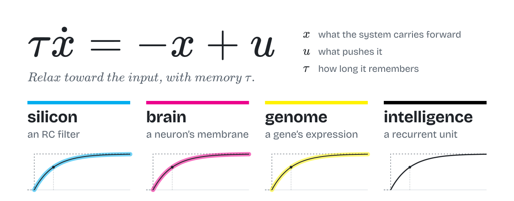
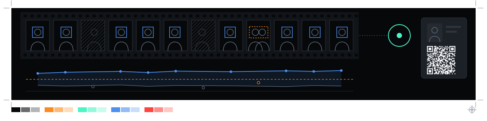
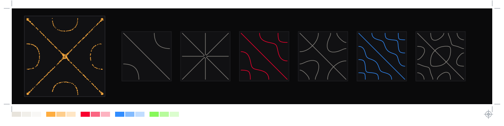
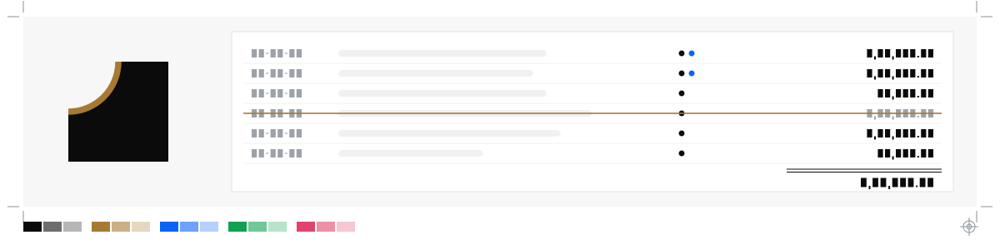
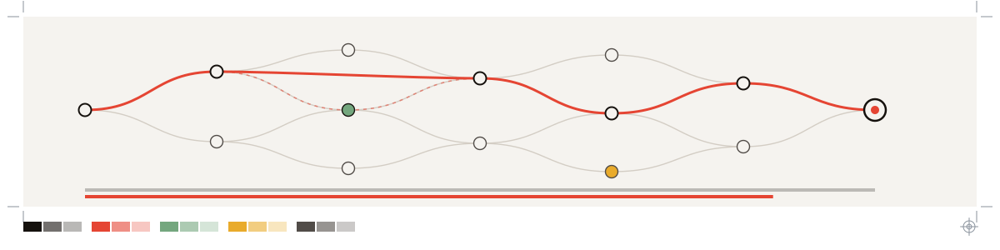
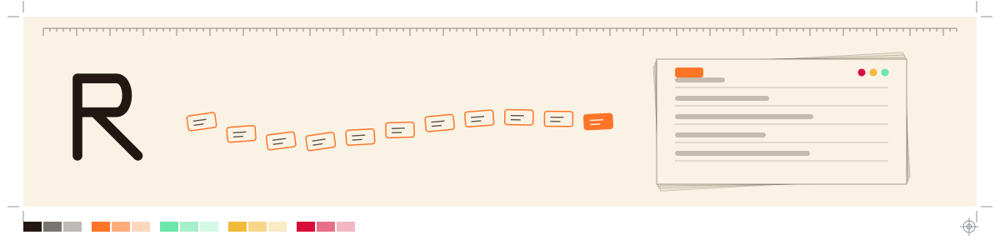
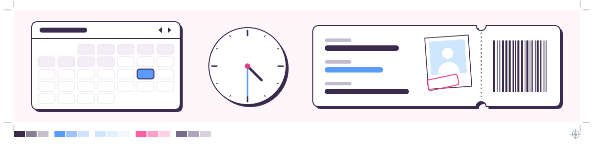

<picture>
  <source media="(prefers-color-scheme: dark)" srcset="assets/hero-dark.svg">
  
</picture>

I used to be an editor and a graphic designer, and the two jobs turned out to be one: predicting what a brain does with what you show it. Where the eye lands. What a cut makes you feel. What you fill in unasked.

Then the brain got more interesting than anything I could show it. So I study computer science and build the machinery myself: a camera that knows when it isn't sure, a ledger nobody can quietly edit, an engine that shows its working.

## The long game

<picture>
  <source media="(prefers-color-scheme: dark)" srcset="assets/matter-dark.svg">
  
</picture>

My long-term goal is a system where brain, silicon, genome and intelligence work as one. They already share mathematics: the line above describes a capacitor charging, a neuron below threshold, a protein settling to its steady level and the memory in a recurrent network. Same equation, different physics.

I'm working toward it with *Matter That Knows*, a field manual I wrote around one question: how does matter come to sense, predict, remember, decide and act, and how do we build it? Its rules: predict a number before you measure, build what you want to understand, and give every analogy the result that would break it.

| Bridge | Biology | Machine | Breaks if |
| :-- | :-- | :-- | :-- |
| Membrane = RC circuit | A neuron's leak and capacitance | Leaky integrate-and-fire unit | Voltage-gated channels take over |
| Dopamine = TD error | Burst on surprise, dip on omission | $\delta = r + \gamma V(s') - V(s)$ | Dopamine tracks salience, not value |
| Memory = energy minimum | Hippocampal attractors | Hopfield networks; attention is one update step | Recall isn't attractor dynamics |
| Genome = program | Gene regulatory networks | Boolean circuits; DNA language models | Chemistry outweighs sequence |

The builds climb from a membrane to a language model: my own body signals, a neuron from scratch, memory as energy, GPT from scratch, and spiking neurons in Verilog on an FPGA, with hardware alongside, from a precision logger to a RISC-V CPU. Nothing has a date; you move on when the proof holds. I'm at horizon one: measure and model.

## Proofs

In print, a proof is the test sheet you check before the run. These are mine from 2026.

### campus-guard

**A campus ID check that never accuses anyone on a single frame.** A patrol rover's camera finds people, recognises enrolled students and checks their ID cards. Only well-evidenced violations reach a human, who decides on any fine.

- Identity is decided across many frames, and the best match must beat the runner-up by a margin. "Not sure" can never become an accusation.
- If the tracker fuses two people into one ID, the system blames neither; a face that could be two people goes to no one.
- ID cards carry HMAC-signed QR codes sized from the optics, and three models (YOLO11 with ByteTrack, InsightFace, YOLO-World) share one real-time loop on a laptop.

**Proven:** end to end on a live webcam; CI green with 770 Python and 242 TypeScript tests. **Not yet:** calibrated accuracy, or a run on the rover.

Python, FastAPI, Ultralytics, InsightFace, Supabase, Next.js. Private repo; a simulator with the same thresholds runs on the <a href="https://vishvakrit.vercel.app/projects/rudram/">RUDRAM page</a>.

### VISHVAKRIT

**My robotics team's website, where you can take the machines apart.** I'm the software lead of VISHVAKRIT, two students building robots that keep watch. The site shows RUDRAM, a campus-security rover prototype, and MATSYA, an underwater drone concept, in 3D, with five physics simulations.

- Both machines are modelled in code, with no model files. RUDRAM's wheel holes spell its name in Morse, as Curiosity's spell JPL.
- The water is hand-written GLSL: caustics on the hull, 1,400 flecks of marine snow in the vertex shader, and red light fading first with depth.
- A frame pacer trades resolution for speed by a square-root law, every sound is synthesised live, and the logo is a computed Chladni figure.

**Live:** [vishvakrit.vercel.app](https://vishvakrit.vercel.app)

three.js, GLSL, GSAP, Vite. 20 QA suites with mutation testing.

### ledger-one

**The back office for a 195-villa housing project, where money can't be quietly edited.** Built solo in about 25 days for a society's board: members, plots, payments, dues and an audit trail nobody can rewrite.

- Postgres itself makes money append-only: triggers refuse updates and deletes, and a payment can only be voided, with a reason.
- Amounts are integer paise end to end, a commit-time constraint makes every payment's split lines sum exactly, and large payments need a second board member's approval.
- The importer tames a messy real spreadsheet: it finds headers anywhere, never mistakes subtotals for payments, and must pass a reconciliation check in the database before writing.

**Proven:** 1,192 unit tests passing, plus 121 end-to-end tests; CI adds a dependency audit and a secret scan.

Next.js 16, React 19, TypeScript, Supabase Postgres with row-level security on all 28 tables, Vitest, fast-check. Private, since it's built for a real board.

### DAARI

**A career-path engine for Andhra Pradesh that shows its working.** *Daari* is Telugu for "the path". Name a job and it plans what to learn, in order, then shows exactly what changes when you learn a skill or the market moves. Built at a hackathon with team ASURA; I wrote the engine.

- The language model never decides: every number comes from deterministic code, with its parts.
- The roadmap is a demand-weighted topological order. On the live demo, learning SQL cuts a 310-hour path by 40 hours.
- A Rasch-model adaptive skill test, and a Scam Shield that quotes the exact words behind each flag.

**Live:** [daari-web.vercel.app](https://daari-web.vercel.app), with the engine in [its pull request](https://github.com/dmrk22/asura/pull/1). **Not yet:** 24 skills and 2 roles so far.

Python, FastAPI, NumPy, NetworkX, Hypothesis, Next.js, next-intl. English, Telugu and Hindi. Built in two days.

### rebeka

**A personal operating system, built foundation first.** It will turn what my phone already sees (bank messages, payments, location, health) into numbers I can act on, like classes I can still miss or what's safe to spend. No AI at runtime, and every number traceable to its rule and records.

- Append-only Postgres with provenance on every row; the database refuses edits.
- An idempotent ingest API: rate limits before any database work, hashed per-device tokens and a 14-type event contract.
- Branded types make mixing paise with minutes a compile error, and CI gates the design on contrast, golden-ratio layout, frame time and Lighthouse.

**Proven:** 788 tests; a red-team audit fixed 16 of 16 findings, each with a test that failed first. **Next:** the money, attendance and forecast engines.

TypeScript, Hono, Drizzle, PostgreSQL, React 19, Vite, Docker. Private repo.

### Appointment booking portal

**A phone-first booking portal in 68 KB of gzipped JavaScript.** Pick a date, a time and a place, add a reason, confirm with a photo, and get a pass to share or add to your calendar. No backend, no accounts, no tracking; photos never leave the device unless shared.

- Every visual is drawn in code, as SVG, CSS or canvas, with no image files beyond the favicon.
- Confirmation is one choreographed timeline: pixels assemble into an icon, morph into a vector and burst into 150 particles.
- The pass is drawn on a 1080 × 1920 canvas, and calendar files follow RFC 5545 down to line folding.

**Live:** [appointment-desk-flax.vercel.app](https://appointment-desk-flax.vercel.app)

TypeScript, GSAP, Canvas, Web Share. 14 Playwright tests across four device profiles. Built in about six hours. Private repo.

## How I work

I build with AI agents, and it feels like editing: drafts are cheap, judgment isn't. I decide what the thing is, what counts as done and what would prove it, then cut until the proof holds. Specs come before code, decision logs only grow, the database enforces the rules, and audits end in a table of finding, evidence, fix and regression test.

 

Set in Bricolage Grotesque, maths in TeX. The top of this page prints like a press sheet: three colour plates register, then the key plate prints the name. Generated by <a href="tools/build.html">tools/build.html</a>.

